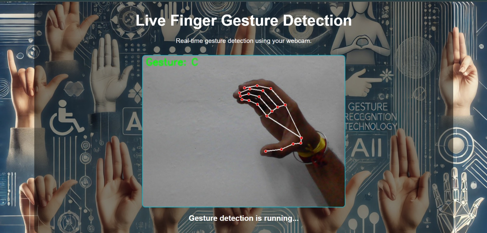
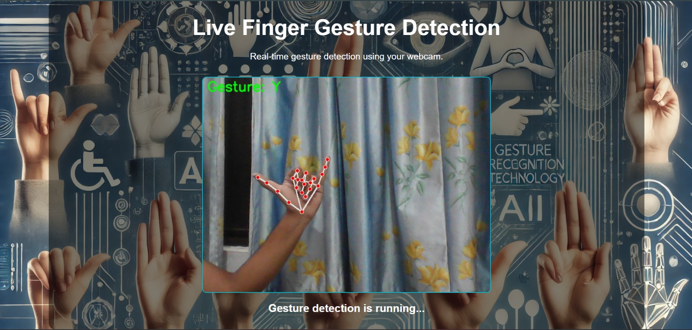

# 🧏‍♀️ SignTALK – Bridging Communication Through Indian Sign Language

## Overview
I have created a computer vision model that coverts sign language to english by detecting the hand gesture

 

## Installation
1. Clone the repository:  git clone https://github.com/SayaiB24/Sign-Talk-private

2. Install dependencies:  pip install -r requirements.txt

3. Navigate to the `app2.py` directory inside the backend directory

4. Run the 'app2.py' file: python app2.py

5. Go over to the fronend folder and run idex.html

## Usage

- Users can sign into the webcam, and the system will recognize and translate gestures.
The translated text will be displayed on the screen in real time.

 
## Example Image  

## Future Plans  
- 🔮 Future Scope
- 🌍 Multilingual Support (Sign to multiple languages).
- 📱 Mobile Application version.
- 🤖 Improved AI Model for better accuracy. 

## Contributors
- Sayali Bambal (https://github.com/SayaiB24)  
- Rochan Awasthi (https://github.com/Macbeth1501)  
  
